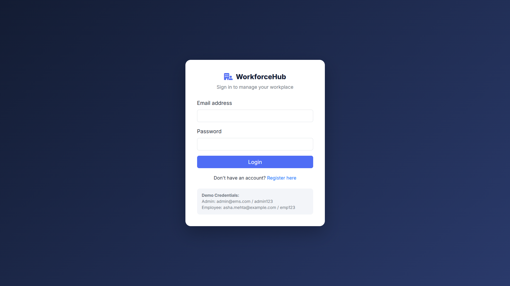
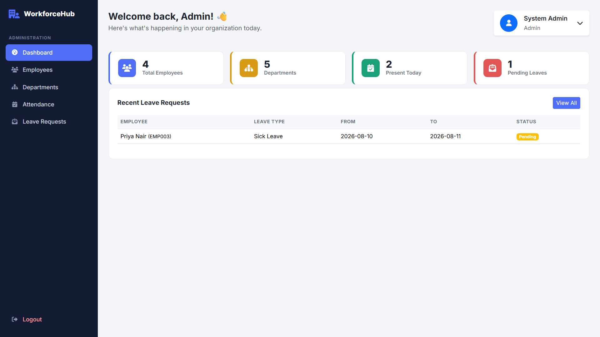
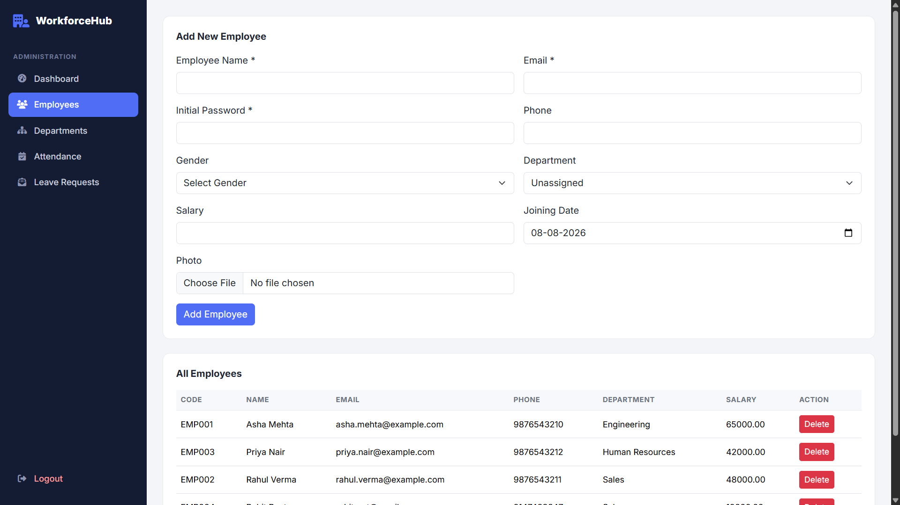
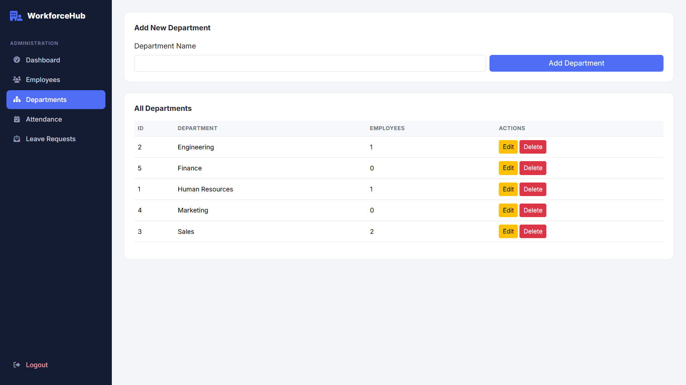
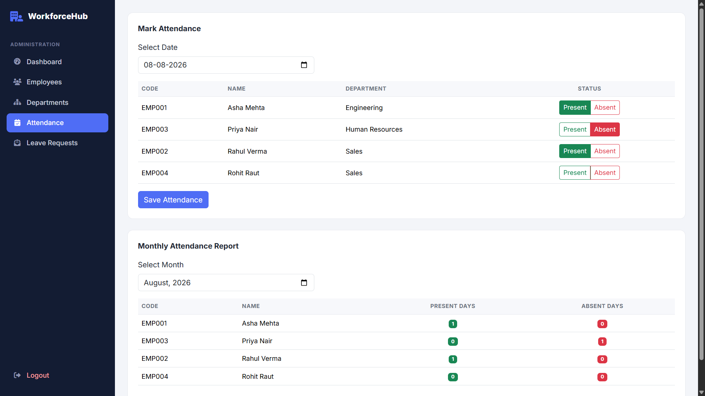
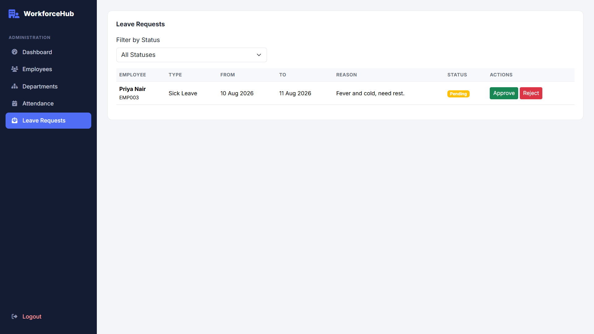
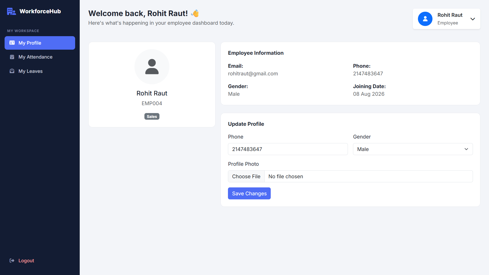

# WorkforceHub – Employee Management & HR System

WorkforceHub is a web-based Employee Management & HR System built with PHP, MySQL, HTML, CSS, JavaScript, and Bootstrap. It provides separate Admin and Employee functionality for managing employee records, departments, attendance, leave requests, profiles, and HR-related operations

[](https://www.php.net/)
[](https://www.mysql.com/)
[](https://getbootstrap.com/)
[](LICENSE)

## 🌐 Live Demo

**Live Project:** https://workforcehub.freedev.app/

> The live demo is provided for portfolio and demonstration purposes.

------------------------------------------------------------------------

## 🔐 Demo Credentials

### Admin

  Field      Value
  ---------- -----------------
  Email      `admin@ems.com`
  Password   `admin123`
  Access     Admin Dashboard

### Employee

  Field      Value
  ---------- --------------------------
  Email      `asha.mehta@example.com`
  Password   `emp123`
  Access     Employee Dashboard

**Additional employee demo account**

  Field      Value
  ---------- ---------------------------
  Email      `rahul.verma@example.com`
  Password   `emp123`

> **Note:** These are demo credentials for the portfolio version. Change
> or remove default credentials before using the project in a real
> production environment.

------------------------------------------------------------------------

# 📌 About the Project

**WorkforceHub** is a role-based Employee Management & HR System
designed to simplify common employee-management tasks in an
organization.

The system provides separate access for **Admin** and **Employee**
users.

### Admin can manage:

-   Employees
-   Departments
-   Attendance
-   Leave requests
-   Dashboard statistics
-   Employee records
-   Employee profile photos

### Employees can:

-   View their profile
-   Update profile information
-   View attendance
-   Apply for leave
-   View leave history
-   Manage their profile photo

The project is intentionally built using **core PHP and MySQL** without
a framework so that the application logic remains easy to understand and
suitable for learning PHP full-stack development.

------------------------------------------------------------------------

# ✨ Features

## 👑 Admin Features

### Dashboard

-   Total employees
-   Total departments
-   Today's attendance
-   Pending leave requests
-   Recent leave requests

### Employee Management

-   Add employee
-   View employee records
-   Edit employee information
-   Delete employee
-   Search employees
-   Filter employees
-   Assign department
-   Store salary information
-   Store joining date
-   Upload employee photo
-   Activate/deactivate employee records

### Department Management

-   Add department
-   View departments
-   Edit department
-   Delete department

### Attendance Management

-   Select attendance date
-   Mark employees as Present/Absent
-   Update existing attendance
-   View attendance records
-   Monthly attendance filtering
-   Attendance summary

### Leave Management

-   View leave requests
-   Filter by leave status
-   Approve leave
-   Reject leave
-   View leave details

------------------------------------------------------------------------

## 👨‍💼 Employee Features

### Employee Dashboard

Employees have access to their own employee area.

### Profile

-   View personal information
-   Update phone
-   Update gender
-   Upload profile photo

### Attendance

-   View personal attendance
-   Filter attendance by month

### Leave Management

-   Apply for leave
-   Select leave type
-   Select start and end dates
-   Add reason
-   View previous leave requests
-   Track Pending / Approved / Rejected status

------------------------------------------------------------------------

# 🔐 Authentication & Authorization

WorkforceHub uses session-based authentication with two user roles:

``` text
Admin
  ↓
Full system access

Employee
  ↓
Own profile
Own attendance
Own leave requests
```

The application uses:

-   Login/logout
-   PHP sessions
-   Password hashing
-   Password verification
-   Role-based authorization
-   Protected Admin pages
-   Protected Employee pages
-   Prepared SQL statements

------------------------------------------------------------------------

# 🛠️ Technology Stack

### Frontend

-   HTML5
-   CSS3
-   JavaScript
-   Bootstrap 5

### Backend

-   PHP
-   MySQLi

### Database

-   MySQL
-   Relational tables
-   Primary keys
-   Foreign keys
-   Unique constraints
-   ENUM fields

### Development Environment

-   XAMPP
-   Apache
-   MySQL
-   VS Code
-   phpMyAdmin

------------------------------------------------------------------------

# 🗄️ Database Structure

The project uses the following main tables:

``` text
departments
    │
    └── employees
            │
            ├── users
            ├── attendance
            └── leaves
```

### Main Tables

  Table           Purpose
  --------------- -----------------------------
  `users`         Login accounts and roles
  `employees`     Employee information
  `departments`   Department information
  `attendance`    Employee attendance records
  `leaves`        Employee leave requests

### Important Relationships

``` text
departments.id
      ↓
employees.department_id

employees.id
      ↓
users.employee_id

employees.id
      ↓
attendance.employee_id

employees.id
      ↓
leaves.employee_id
```

------------------------------------------------------------------------

# 📁 Project Structure

``` text
employee-management-system/
│
├── admin/
│   ├── dashboard.php
│   ├── employees.php
│   ├── departments.php
│   ├── attendance.php
│   └── leaves.php
│
├── employee/
│   ├── attendance.php
│   ├── leave.php
│   └── profile.php
│
├── includes/
│   ├── auth.php
│   ├── header.php
│   └── footer.php
│
├── config/
│   └── database.php
│
├── assets/
│   ├── css/
│   ├── js/
│   └── images/
│
├── uploads/
│
├── database.sql
├── index.php
├── login.php
├── register.php
└── logout.php
```

------------------------------------------------------------------------

# 🚀 Installation & Setup

## 1. Clone the repository

``` bash
git clone https://github.com/rohit-raut8082/WorkforceHub-Employee-Management-HR-System.git
```

Or download the ZIP and extract it.

## 2. Move the project to XAMPP

Place the project inside:

``` text
C:\xampp\htdocs\
```

Example:

``` text
C:\xampp\htdocs\employee-management-system\
```

## 3. Start XAMPP

Start:

``` text
Apache
MySQL
```

## 4. Create the database

Open:

``` text
http://localhost/phpmyadmin
```

Import:

``` text
database.sql
```

The SQL file creates:

``` text
ems_db
```

## 5. Configure the database

Open:

``` text
config/database.php
```

Update the database credentials if required:

``` php
$host = "localhost";
$username = "root";
$password = "";
$database = "ems_db";
```

## 6. Open the application

``` text
http://localhost/employee-management-system/
```

------------------------------------------------------------------------

# 🔑 How Employee Login Works

An employee account is connected to an employee record.

``` text
Admin creates employee
        ↓
Employee record
        ↓
Login account
        ↓
Employee logs in
        ↓
Employee Dashboard
```

Employee access is restricted to employee-specific pages.

Admin access is restricted to administrative pages.

------------------------------------------------------------------------

# 📸 Screenshots


### Login



### Admin Dashboard



### Employee Management



### Department Management



### Attendance Management



### Leave Management



### Employee Dashboard / Profile



```

------------------------------------------------------------------------

# 🧪 Testing Checklist

Before deploying or presenting the project, test:

### Authentication

-   [ ] Admin login
-   [ ] Employee login
-   [ ] Invalid login
-   [ ] Logout
-   [ ] Admin cannot access employee-only pages
-   [ ] Employee cannot access admin pages

### Employees

-   [ ] Add employee
-   [ ] Edit employee
-   [ ] Delete employee
-   [ ] Search employee
-   [ ] Filter employee
-   [ ] Upload employee photo

### Departments

-   [ ] Add department
-   [ ] Edit department
-   [ ] Delete department

### Attendance

-   [ ] Mark Present
-   [ ] Mark Absent
-   [ ] Update attendance
-   [ ] Filter by month
-   [ ] View attendance summary

### Leaves

-   [ ] Apply for leave
-   [ ] View leave history
-   [ ] Approve leave
-   [ ] Reject leave
-   [ ] Filter leave status

------------------------------------------------------------------------

# 🔒 Security Practices

The project uses several basic security practices:

-   Passwords are stored using password hashing.
-   Passwords are verified using `password_verify()`.
-   Database queries use prepared statements.
-   Sessions are used for authentication.
-   Role checks protect Admin and Employee pages.
-   User input is validated before database operations.
-   Output is escaped where appropriate.
-   Employee photos are handled through an upload directory.

> This project is intended as a learning and portfolio project. A
> production deployment should additionally use HTTPS, secure
> environment-based database credentials, stronger upload restrictions,
> CSRF protection, rate limiting, secure session cookie settings, and
> removal/change of demo credentials.

------------------------------------------------------------------------

# 🎯 Learning Objectives

This project was built to practice:

-   Core PHP
-   PHP functions
-   Forms and form validation
-   CRUD operations
-   MySQL
-   SQL queries
-   Prepared statements
-   Database relationships
-   Sessions
-   Authentication
-   Authorization
-   Password hashing
-   File uploads
-   Bootstrap
-   Responsive web design
-   Dashboard development
-   Real-world project structure

------------------------------------------------------------------------

# 🔮 Future Improvements

Possible features for future versions:

-   Password reset
-   Change password
-   Force password change on first login
-   CSRF protection
-   Email notifications
-   Payroll management
-   Performance management
-   Employee search improvements
-   Export reports to PDF/Excel
-   Advanced attendance reports
-   Audit logs
-   Admin profile/settings
-   REST API
-   Laravel version

------------------------------------------------------------------------

# 👨‍💻 Author

**Rohit Raut**

B.Tech Computer Science Student\
PHP Full Stack Developer

### Project

**WorkforceHub --- Employee Management & HR System**

------------------------------------------------------------------------

# ⭐ If you like this project

If you find this project useful for learning PHP and MySQL, consider
giving the repository a ⭐ on GitHub.
